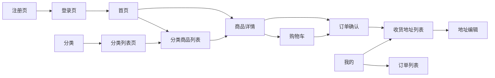

# 页面 UI 原型 · 视觉与交互总规范

> 依据：`需求文档`  
> 整体风格：模仿京东（JD.com）商城页面  
> （由 Curosr 自动生成）

---

## 1. 色彩（京东风）

| 用途 | 色值 | 说明 |
|------|------|------|
| 品牌红 / 主按钮 | `#E4393C` | 登录、结算、支付、加入购物车等主 CTA |
| 价格红 | `#E4393C` | 商品价格强调 |
| 链接蓝 | `#005AA0` | 次要文字链（如「去登录」） |
| 页面底色 | `#F5F5F5` | 列表页灰色背景 |
| 卡片/内容白 | `#FFFFFF` | 模块底板 |
| 主文字 | `#333333` | 标题、正文 |
| 次文字 | `#999999` | 提示、库存、辅助说明 |
| 边框线 | `#E6E6E6` | 分割线、输入框边框 |
| 成功绿 | `#67C23A` | 成功提示（可选） |
| 错误红 | `#F56C6C` | 登录/注册失败文案 |

---

## 2. 字体与间距

| 维度 | 规范 |
|------|------|
| 字体 | 系统无衬线（PingFang SC / Microsoft YaHei / sans-serif） |
| 页面标题 | 16–18px，加粗 |
| 商品名 | 14px |
| 价格 | 16–20px，加粗，品牌红 |
| 模块间距 | 8–12px 灰底分隔 |
| 内容边距 | 左右 12–16px |

---

## 3. 底部导航（登录后主站）

未登录访问首页/分类/购物车/我的时，统一跳转登录页。

```
┌──────────┬──────────┬──────────┬──────────┐
│   首页   │   分类   │  购物车  │   我的   │
└──────────┴──────────┴──────────┴──────────┘
```

- 选中态：图标与文字为 `#E4393C`
- 未选中：`#666666`
- 固定底部，内容区预留底部安全高度

---

## 4. 原型文件清单（一功能一图）

| 序号 | 功能 | 文件 |
|------|------|------|
| 0.1 | 登录页 | [UI原型-登录页.md](./UI原型-登录页.md) |
| 0.2 | 注册页 | [UI原型-注册页.md](./UI原型-注册页.md) |
| 1 | 首页 | [UI原型-首页.md](./UI原型-首页.md) |
| 2 | 分类 | [UI原型-分类.md](./UI原型-分类.md) |
| 3 | 购物车列表页 | [UI原型-购物车列表页.md](./UI原型-购物车列表页.md) |
| 4 | 我的 | [UI原型-我的.md](./UI原型-我的.md) |
| 5 | 商品详情 | [UI原型-商品详情.md](./UI原型-商品详情.md) |
| 6 | 分类列表页 | [UI原型-分类列表页.md](./UI原型-分类列表页.md) |
| 7 | 分类商品列表页 | [UI原型-分类商品列表页.md](./UI原型-分类商品列表页.md) |
| 8 | 订单列表 | [UI原型-订单列表.md](./UI原型-订单列表.md) |
| 9 | 收货地址列表 | [UI原型-收货地址列表.md](./UI原型-收货地址列表.md) |
| 9.x | 收货地址编辑页 | [UI原型-收货地址编辑页.md](./UI原型-收货地址编辑页.md) |
| 10 | 订单确认页 | [UI原型-订单确认页.md](./UI原型-订单确认页.md) |

---

## 5. 页面跳转总览


