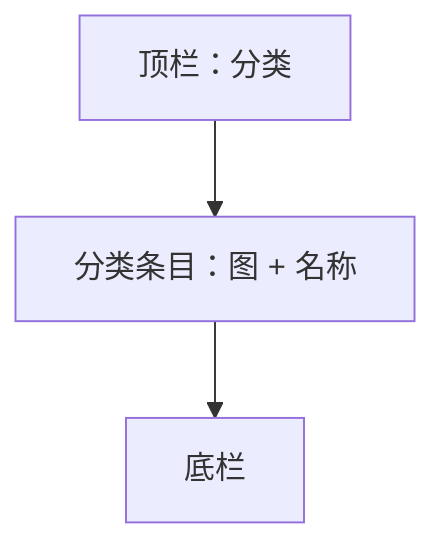

# UI 原型 · 分类

> 需求：2 分类（分类名称 + 分类图片，点击进分类商品列表）  
> 风格：京东风  
> （由 Curosr 自动生成）

---

## 1. 页面信息

| 项 | 说明 |
|----|------|
| 路由建议 | `/category` |
| 访问条件 | 需登录 |
| 底部导航 | 分类（选中） |
| 与「分类列表页」关系 | 本页为底栏「分类」入口；也可提供入口进入双列分类列表页 |

---

## 2. 信息架构



---

## 3. 线框布局

```
┌────────────────────────────────────┐
│              分  类                 │
├────────────────────────────────────┤
│  ┌────┐  手机数码               >  │
│  │ 图 │                            │
│  └────┘                            │
├────────────────────────────────────┤
│  ┌────┐  家用电器               >  │
│  │ 图 │                            │
│  └────┘                            │
├────────────────────────────────────┤
│  ┌────┐  服装鞋包               >  │
│  │ 图 │                            │
│  └────┘                            │
├────────────────────────────────────┤
│  ┌────┐  食品生鲜               >  │
│  │ 图 │                            │
│  └────┘                            │
│            ……                      │
├────────────────────────────────────┤
│  ┌──────────────────────────────┐  │
│  │  查看双列分类列表（可选入口）  │  │  ← 跳转需求 6 分类列表页
│  └──────────────────────────────┘  │
├────────────────────────────────────┤
│  首页 │ 分类* │ 购物车 │ 我的      │
└────────────────────────────────────┘
```

---

## 4. 交互说明

| 操作 | 行为 |
|------|------|
| 点击某一分类行/图 | 跳转该分类对应的商品列表页 |
| 点击双列列表入口 | 跳转分类列表页（每行 2 个） |

---

## 5. 组件要点

- 列表白底，行高约 64–72px
- 分类图方形圆角，左侧；名称居中偏左；右侧 `>`
- 行分割线 `#E6E6E6`
