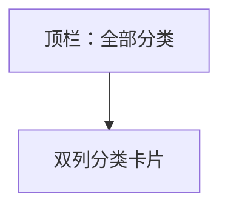

# UI 原型 · 分类列表页

> 需求：6 分类列表页（名称 + 图片，每行 2 个）  
> 风格：京东风  
> （由 Curosr 自动生成）

---

## 1. 页面信息

| 项 | 说明 |
|----|------|
| 路由建议 | `/categories` |
| 访问条件 | 需登录 |
| 布局 | 双列网格，每行 2 个分类 |
| 点击 | 进入对应分类商品列表页 |

---

## 2. 信息架构



---

## 3. 线框布局

```
┌────────────────────────────────────┐
│  ← 返回                   全部分类  │
├────────────────────────────────────┤
│  ┌─────────────┐  ┌─────────────┐  │
│  │   分类图     │  │   分类图     │  │
│  │  手机数码    │  │  家用电器    │  │
│  └─────────────┘  └─────────────┘  │
│  ┌─────────────┐  ┌─────────────┐  │
│  │   分类图     │  │   分类图     │  │
│  │  服装鞋包    │  │  食品生鲜    │  │
│  └─────────────┘  └─────────────┘  │
│  ┌─────────────┐  ┌─────────────┐  │
│  │   分类图     │  │   分类图     │  │
│  │  美妆个护    │  │  图书音像    │  │
│  └─────────────┘  └─────────────┘  │
│                                    │
└────────────────────────────────────┘
```

---

## 4. 交互说明

| 操作 | 行为 |
|------|------|
| 点击分类卡片 | 跳转该分类的商品列表页 |
| 返回 | 回分类 Tab 或上一页 |

---

## 5. 组件要点

- 卡片白底微阴影或细边框，圆角 4–8px
- 图在上、名称居中在下
- 两列间距约 8–12px，页面灰底 `#F5F5F5`
