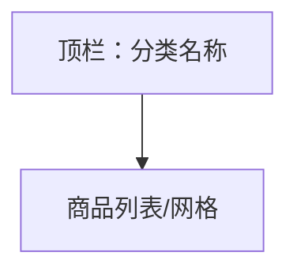

# UI 原型 · 分类商品列表页

> 需求：7 分类对应的商品列表页  
> 风格：京东风  
> （由 Curosr 自动生成）

---

## 1. 页面信息

| 项 | 说明 |
|----|------|
| 路由建议 | `/category/{id}/products` |
| 访问条件 | 需登录 |
| 展示字段 | 名称、图片、价格、库存、加入购物车 |
| 点击商品 | 进入商品详情 |

---

## 2. 信息架构



---

## 3. 线框布局

```
┌────────────────────────────────────┐
│  ← 返回                   手机数码  │  ← 标题为当前分类名
├────────────────────────────────────┤
│  ┌──────┐ 商品名称 A               │
│  │ 图   │ ¥ 99.00                  │
│  │      │ 库存：20                 │
│  └──────┘          [加入购物车]    │
├────────────────────────────────────┤
│  ┌──────┐ 商品名称 B               │
│  │ 图   │ ¥ 199.00                 │
│  │      │ 库存：8                  │
│  └──────┘          [加入购物车]    │
├────────────────────────────────────┤
│  ┌──────┐ 商品名称 C               │
│  │ 图   │ ¥ 59.00                  │
│  │      │ 库存：100                │
│  └──────┘          [加入购物车]    │
│                                    │
│  （可改为双列商品网格，与首页卡片一致）│
└────────────────────────────────────┘
```

---

## 4. 双列网格备选

```
┌─────────────┐  ┌─────────────┐
│ 图          │  │ 图          │
│ 名称        │  │ 名称        │
│ ¥价格       │  │ ¥价格       │
│ 库存        │  │ 库存        │
│ [加入购物车] │  │ [加入购物车] │
└─────────────┘  └─────────────┘
```

---

## 5. 交互说明

| 操作 | 行为 |
|------|------|
| 点击商品图/名 | 进入商品详情 |
| 加入购物车 | 加购成功提示 |
| 返回 | 回分类页或分类列表页 |

---

## 6. 视觉要点

- 列表白底分行；或灰底双列卡片
- 价格红；加购按钮小尺寸品牌红
