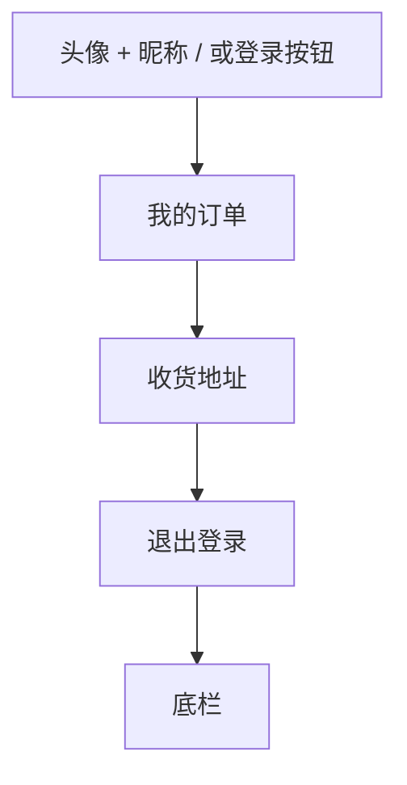

# UI 原型 · 我的

> 需求：4 我的（微信头像昵称、订单、地址、退出）  
> 风格：京东风  
> （由 Curosr 自动生成）

---

## 1. 页面信息

| 项 | 说明 |
|----|------|
| 路由建议 | `/me` 或 `/mine` |
| 访问条件 | 需登录（未登录进本页应跳登录；退出后本页展示游客态） |
| 底部导航 | 我的（选中） |
| 头像昵称来源 | 微信登录授权 |

---

## 2. 信息架构



---

## 3. 线框布局（已登录）

```
┌────────────────────────────────────┐
│  ┌────────────────────────────────┐│
│  │  (头像)   微信昵称              ││  ← 红/深色顶区京东风
│  │           欢迎回来              ││
│  └────────────────────────────────┘│
├────────────────────────────────────┤
│  我的订单                        > │  ← 跳转订单列表
├────────────────────────────────────┤
│  收货地址                        > │  ← 跳转地址列表
├────────────────────────────────────┤
│                                    │
│  ┌──────────────────────────────┐  │
│  │         退出登录              │  │  ← 描边或浅红按钮
│  └──────────────────────────────┘  │
├────────────────────────────────────┤
│  首页 │ 分类 │ 购物车 │ 我的*      │
└────────────────────────────────────┘
```

---

## 4. 线框布局（退出后 / 游客态）

```
┌────────────────────────────────────┐
│  ┌────────────────────────────────┐│
│  │  (默认头像)                     ││
│  │         [ 登 录 ]               ││  ← 头像昵称消失，显示登录按钮
│  └────────────────────────────────┘│
├────────────────────────────────────┤
│  （订单/地址入口可隐藏或点按跳登录） │
├────────────────────────────────────┤
│  首页 │ 分类 │ 购物车 │ 我的*      │
└────────────────────────────────────┘
```

---

## 5. 交互说明

| 操作 | 行为 |
|------|------|
| 我的订单 | 跳转订单列表 |
| 收货地址 | 跳转收货地址列表 |
| 退出登录 | 清除登录态；头像昵称消失；顶区显示登录按钮 |
| 登录按钮 | 跳转登录页 |

---

## 6. 视觉要点

- 顶部个人信息区可用品牌红渐变或深色条，白字
- 菜单行为白底列表 + 右侧 `>`
