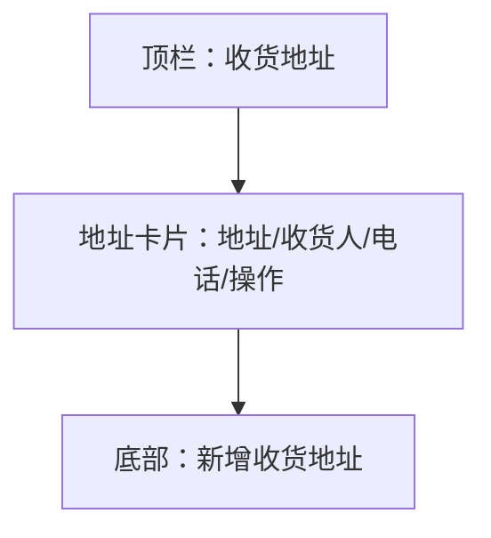

# UI 原型 · 收货地址列表

> 需求：9 收货地址列表  
> 风格：京东风  
> （由 Curosr 自动生成）

---

## 1. 页面信息

| 项 | 说明 |
|----|------|
| 路由建议 | `/addresses` |
| 入口 | 我的 → 收货地址；订单确认页选择地址 |
| 操作 | 编辑、删除、设为默认、底部新增 |

---

## 2. 信息架构



---

## 3. 线框布局

```
┌────────────────────────────────────┐
│  ← 返回                   收货地址  │
├────────────────────────────────────┤
│  ┌──────────────────────────────┐  │
│  │ [默认] 张三  138****0000      │  │
│  │ 北京市朝阳区望京街道××号       │  │
│  │ [设为默认]  [编辑]  [删除]    │  │
│  └──────────────────────────────┘  │
├────────────────────────────────────┤
│  ┌──────────────────────────────┐  │
│  │ 李四  139****1111             │  │
│  │ 上海市浦东新区××路××号         │  │
│  │ [设为默认]  [编辑]  [删除]    │  │
│  └──────────────────────────────┘  │
│                                    │
│  （空：还没有收货地址，请新增）      │
├────────────────────────────────────┤
│  ┌──────────────────────────────┐  │
│  │       ＋ 新增收货地址          │  │  ← 固定底部品牌红按钮
│  └──────────────────────────────┘  │
└────────────────────────────────────┘
```

---

## 4. 交互说明

| 操作 | 行为 |
|------|------|
| 编辑 | 跳转收货地址编辑页（带 id） |
| 删除 | 二次确认后删除 |
| 设为默认 | 当前地址设为默认，其它取消默认标识 |
| 新增收货地址 | 跳转编辑页（新建） |

---

## 5. 组件要点

- 默认地址左上角红色「默认」标签
- 已是默认时「设为默认」可置灰或隐藏
- 删除为次要危险操作，可用文字链红色
