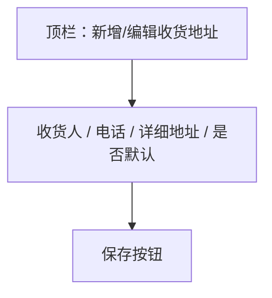

# UI 原型 · 收货地址编辑页

> 需求：9.2 / 9.4 收货地址编辑（新增与编辑共用）  
> 风格：京东风  
> （由 Curosr 自动生成）

---

## 1. 页面信息

| 项 | 说明 |
|----|------|
| 路由建议 | `/address/edit`、`/address/edit/{id}` |
| 入口 | 地址列表「新增」或「编辑」 |
| 成功 | 返回地址列表 |

---

## 2. 信息架构



---

## 3. 线框布局

```
┌────────────────────────────────────┐
│  ← 返回             编辑收货地址    │  ← 新增时标题为「新增收货地址」
├────────────────────────────────────┤
│  收货人                             │
│  ┌──────────────────────────────┐  │
│  │ 请输入收货人姓名               │  │
│  └──────────────────────────────┘  │
│  联系电话                           │
│  ┌──────────────────────────────┐  │
│  │ 请输入手机号                   │  │
│  └──────────────────────────────┘  │
│  详细地址                           │
│  ┌──────────────────────────────┐  │
│  │                              │  │
│  │ 省市区 + 街道门牌（多行）      │  │
│  │                              │  │
│  └──────────────────────────────┘  │
│  ☐ 设为默认收货地址                 │
├────────────────────────────────────┤
│  ┌──────────────────────────────┐  │
│  │           保  存              │  │  ← 品牌红
│  └──────────────────────────────┘  │
└────────────────────────────────────┘
```

---

## 4. 交互说明

| 操作 | 行为 |
|------|------|
| 保存 | 校验必填与手机号格式 → 提交 → 回列表 |
| 返回 | 放弃编辑回列表（可提示未保存） |

---

## 5. 组件要点

- 表单白底分组，标签在上、输入在下
- 与登录注册页输入框风格一致
