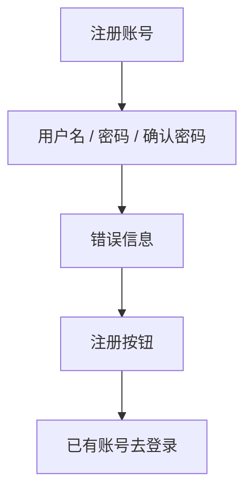

# UI 原型 · 注册页

> 需求：0.2 注册页面  
> 风格：京东风  
> （由 Curosr 自动生成）

---

## 1. 页面信息

| 项 | 说明 |
|----|------|
| 路由建议 | `/register` |
| 字段 | 用户名、密码、确认密码 |
| 成功跳转 | 登录页；后端异步发送注册成功邮件 |
| 失败表现 | 显示错误信息（用户名已存在、两次密码不一致等） |

---

## 2. 信息架构



---

## 3. 线框布局

```
┌────────────────────────────────────┐
│  ← 返回登录                         │
├────────────────────────────────────┤
│                                    │
│              注册账号               │
│                                    │
│  ┌──────────────────────────────┐  │
│  │ 用户名                        │  │
│  └──────────────────────────────┘  │
│  ┌──────────────────────────────┐  │
│  │ 密码                          │  │
│  └──────────────────────────────┘  │
│  ┌──────────────────────────────┐  │
│  │ 确认密码                      │  │
│  └──────────────────────────────┘  │
│                                    │
│  ! 两次密码不一致（失败时显示）      │
│                                    │
│  ┌──────────────────────────────┐  │
│  │         注  册                │  │  ← 品牌红
│  └──────────────────────────────┘  │
│                                    │
│           已有账号？去登录 →         │
│                                    │
│  提示：注册成功后将发送通知邮件      │  ← 次文字 #999
└────────────────────────────────────┘
```

---

## 4. 交互说明

| 操作 | 行为 |
|------|------|
| 点击注册 | 前端校验空值与两次密码一致 → 提交 → 成功跳登录页 |
| 注册失败 | 保留已填内容（密码可清空），展示错误文案 |
| 去登录 | 跳转登录页 |

---

## 5. 组件要点

- 与登录页同系表单样式，保证视觉一致
- 密码框 `type=password`
- 成功后不在本页停留，由登录页承接登录
