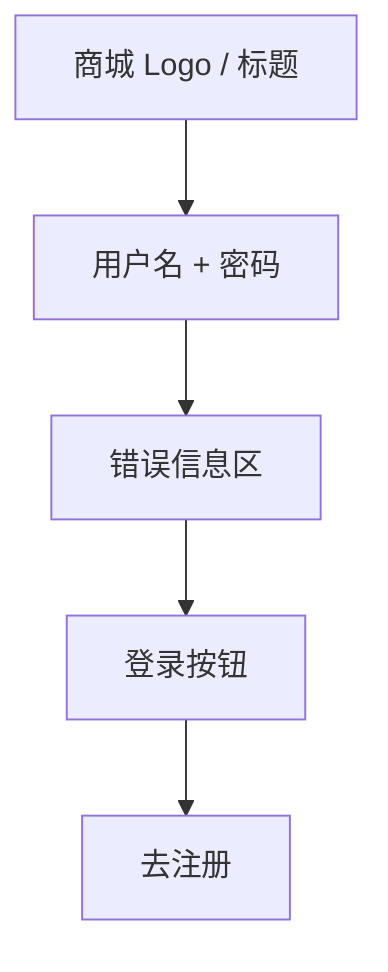

# UI 原型 · 登录页

> 需求：0.1 登录页面  
> 风格：京东风  
> （由 Curosr 自动生成）

---

## 1. 页面信息

| 项 | 说明 |
|----|------|
| 路由建议 | `/login` |
| 访问条件 | 游客可访问；已登录可重定向首页 |
| 成功跳转 | 首页 |
| 失败表现 | 表单上方/字段旁显示错误文案 |

---

## 2. 信息架构



---

## 3. 线框布局

```
┌────────────────────────────────────┐
│            ← （无底栏）              │
├────────────────────────────────────┤
│                                    │
│         ┌──────────────┐           │
│         │   商城 Logo  │           │
│         └──────────────┘           │
│           欢迎登录                  │
│                                    │
│  ┌──────────────────────────────┐  │
│  │ 用户名                        │  │
│  └──────────────────────────────┘  │
│  ┌──────────────────────────────┐  │
│  │ 密码                          │  │
│  └──────────────────────────────┘  │
│                                    │
│  ! 用户名或密码错误（失败时显示）     │
│                                    │
│  ┌──────────────────────────────┐  │
│  │         登  录                │  │  ← 品牌红实心按钮
│  └──────────────────────────────┘  │
│                                    │
│           还没有账号？去注册 →       │  ← 链接蓝
│                                    │
└────────────────────────────────────┘
```

---

## 4. 交互说明

| 操作 | 行为 |
|------|------|
| 点击登录 | 校验非空 → 请求登录 → 成功进首页；失败展示错误信息 |
| 点击去注册 | 跳转注册页 |
| 回车 | 同点击登录 |

---

## 5. 组件要点

- 输入框：白底、浅灰边框、圆角 2–4px
- 主按钮：全宽、高 40–44px、`#E4393C`、白字
- 错误文案：`#F56C6C`，登录失败时可见
