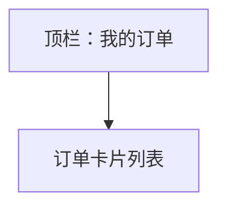

# UI 原型 · 订单列表

> 需求：8 订单列表  
> 风格：京东风  
> （由 Curosr 自动生成）

---

## 1. 页面信息

| 项 | 说明 |
|----|------|
| 路由建议 | `/orders` |
| 入口 | 我的 → 我的订单 |
| 访问条件 | 需登录 |
| 展示字段 | 订单号、状态、金额、时间、收货地址 |

---

## 2. 信息架构



---

## 3. 线框布局

```
┌────────────────────────────────────┐
│  ← 返回                   我的订单  │
├────────────────────────────────────┤
│  ┌──────────────────────────────┐  │
│  │ 订单号：202607180001          │  │
│  │ 状态：待支付          ¥247.00 │  │  ← 状态可用红/橙标签
│  │ 下单时间：2026-07-18 12:00:00 │  │
│  │ 收货地址：北京市朝阳区××路××号 │  │
│  └──────────────────────────────┘  │
├────────────────────────────────────┤
│  ┌──────────────────────────────┐  │
│  │ 订单号：202607170088          │  │
│  │ 状态：已支付          ¥99.00  │  │
│  │ 下单时间：2026-07-17 09:30:00 │  │
│  │ 收货地址：上海市浦东新区××     │  │
│  └──────────────────────────────┘  │
│                                    │
│  （空列表：暂无订单）                │
└────────────────────────────────────┘
```

---

## 4. 交互说明

| 操作 | 行为 |
|------|------|
| 返回 | 回「我的」页 |
| 点击订单卡片 | 本期可仅展示；后续可扩展订单详情 |

---

## 5. 组件要点

- 每单一张白卡片，间距 8–12px 灰底
- 金额右对齐品牌红
- 状态文字按枚举着色（待支付红、已支付绿、已取消灰）
