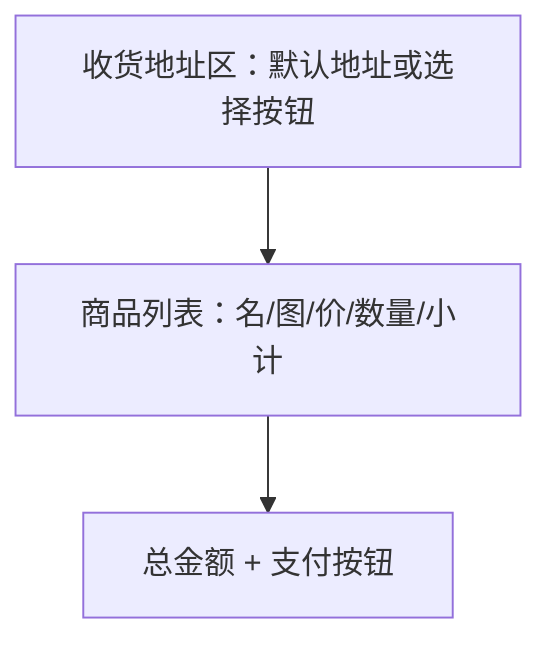

# UI 原型 · 订单确认页

> 需求：10 订单确认页（地址、商品、总金额、微信支付）  
> 风格：京东风  
> （由 Curosr 自动生成）

---

## 1. 页面信息

| 项 | 说明 |
|----|------|
| 路由建议 | `/order/confirm` |
| 入口 | 购物车结算 / 商品详情立即购买 |
| 访问条件 | 需登录 |
| 支付 | 点击支付启动微信支付流程 |

---

## 2. 信息架构



---

## 3. 线框布局（有默认地址）

```
┌────────────────────────────────────┐
│  ← 返回                   确认订单  │
├────────────────────────────────────┤
│  ┌──────────────────────────────┐  │
│  │ 收货人：张三  138****0000  >  │  │  ← 可点进地址列表重选
│  │ 北京市朝阳区望京街道××号       │  │
│  │ [默认]                        │  │
│  └──────────────────────────────┘  │
├────────────────────────────────────┤
│  商品清单                           │
│  ┌────┐ 商品 A                     │
│  │ 图 │ ¥99.00 × 1    小计 ¥99.00  │
│  └────┘                            │
│  ┌────┐ 商品 B                     │
│  │ 图 │ ¥59.00 × 2    小计 ¥118.00 │
│  └────┘                            │
├────────────────────────────────────┤
│  商品总额                   ¥217.00 │
│  （运费等可后续扩展）                │
├────────────────────────────────────┤
│  应付金额 ¥217.00      [微信支付]  │  ← 底部固定栏，红按钮
└────────────────────────────────────┘
```

---

## 4. 线框布局（无默认地址）

```
┌────────────────────────────────────┐
│  ← 返回                   确认订单  │
├────────────────────────────────────┤
│  ┌──────────────────────────────┐  │
│  │                              │  │
│  │     [ 选择收货地址 ]          │  │  ← 跳转收货地址列表
│  │                              │  │
│  └──────────────────────────────┘  │
├────────────────────────────────────┤
│  （商品清单同上）                    │
├────────────────────────────────────┤
│  应付金额 ¥217.00      [微信支付]  │  ← 无地址时按钮禁用并提示
└────────────────────────────────────┘
```

---

## 5. 交互说明

| 操作 | 行为 |
|------|------|
| 有默认地址 | 顶部直接展示默认地址 |
| 无默认地址 | 显示「选择收货地址」按钮 |
| 点击地址区 / 选择按钮 | 进入收货地址列表选择 |
| 微信支付 | 校验已选地址 → 调起微信支付流程 |

---

## 6. 组件要点

- 地址卡片顶部可加定位图标
- 小计与应付金额用品牌红
- 支付按钮文案「微信支付」，体现支付渠道
