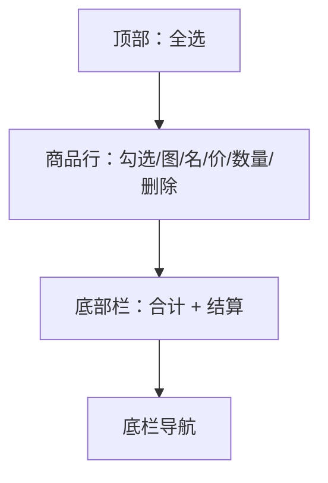

# UI 原型 · 购物车列表页

> 需求：3 购物车列表页  
> 风格：京东风  
> （由 Curosr 自动生成）

---

## 1. 页面信息

| 项 | 说明 |
|----|------|
| 路由建议 | `/cart` |
| 访问条件 | 需登录 |
| 底部导航 | 购物车（选中） |
| 结算跳转 | 订单确认页（仅已勾选商品） |

---

## 2. 信息架构



---

## 3. 线框布局

```
┌────────────────────────────────────┐
│  ☐ 全选                      购物车 │
├────────────────────────────────────┤
│  ☐ ┌────┐ 商品名称 A          [删] │
│    │ 图 │ ¥ 99.00                  │
│    └────┘ 数量  [－] 1 [＋]         │
├────────────────────────────────────┤
│  ☑ ┌────┐ 商品名称 B          [删] │
│    │ 图 │ ¥ 59.00                  │
│    └────┘ 数量  [－] 2 [＋]         │
├────────────────────────────────────┤
│  ☐ ┌────┐ 商品名称 C          [删] │
│    │ 图 │ ¥ 129.00                 │
│    └────┘ 数量  [－] 1 [＋]         │
│                                    │
│  （空车时：购物车是空的，去首页逛逛） │
├────────────────────────────────────┤
│  ☐全选   合计：¥247.00   [去结算]  │  ← 底栏红按钮
├────────────────────────────────────┤
│  首页 │ 分类 │ 购物车* │ 我的      │
└────────────────────────────────────┘
```

---

## 4. 交互说明

| 操作 | 行为 |
|------|------|
| 单项勾选 | 更新合计与全选状态 |
| 全选 | 勾选/取消全部商品 |
| ＋ / － | 修改数量（最小 1；库存上限提示） |
| 删除 | 确认后移除该行 |
| 去结算 | 无勾选时提示；有勾选则进订单确认页 |

---

## 5. 组件要点

- 复选框在左侧，京东常见方形勾选
- 价格红；数量步进器边框灰
- 结算按钮禁用态：未勾选时灰底不可点
