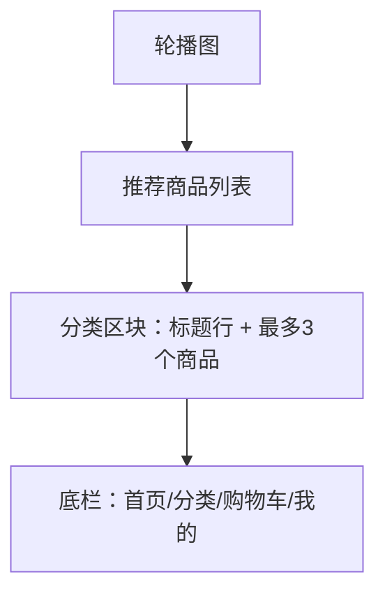

# UI 原型 · 首页

> 需求：1 首页（轮播图、推荐商品、分类商品预览）  
> 风格：京东风  
> （由 Curosr 自动生成）

---

## 1. 页面信息

| 项 | 说明 |
|----|------|
| 路由建议 | `/` 或 `/home` |
| 访问条件 | 需登录，否则跳登录页 |
| 底部导航 | 首页（选中） |

---

## 2. 信息架构



---

## 3. 线框布局

```
┌────────────────────────────────────┐
│  商城名 / 搜索占位（可选）           │  ← 顶栏白底
├────────────────────────────────────┤
│  ┌──────────────────────────────┐  │
│  │                              │  │
│  │         轮 播 图              │  │  ← 可左右滑，圆点指示
│  │                              │  │
│  └──────────────────────────────┘  │
│  ● ○ ○                             │
├────────────────────────────────────┤
│  推荐商品                           │
│  ┌──────┐ ┌──────┐ ┌──────┐       │
│  │ 图   │ │ 图   │ │ 图   │       │  ← 可横滑或两列网格
│  │ 名称 │ │ 名称 │ │ 名称 │       │
│  │ ¥99  │ │ ¥59  │ │ ¥129 │       │
│  │ 库存 │ │ 库存 │ │ 库存 │       │
│  │[加购]│ │[加购]│ │[加购]│       │
│  └──────┘ └──────┘ └──────┘       │
├────────────────────────────────────┤
│  手机数码                        >  │  ← 整行可点，进分类商品列表
│  ┌──────┐ ┌──────┐ ┌──────┐       │
│  │ 商品 │ │ 商品 │ │ 商品 │       │  ← 每分类最多 3 个
│  │ ¥..  │ │ ¥..  │ │ ¥..  │       │
│  │[加购]│ │[加购]│ │[加购]│       │
│  └──────┘ └──────┘ └──────┘       │
├────────────────────────────────────┤
│  家用电器                        >  │
│  ┌──────┐ ┌──────┐ ┌──────┐       │
│  │ ...  │ │ ...  │ │ ...  │       │
│  └──────┘ └──────┘ └──────┘       │
├────────────────────────────────────┤
│  首页* │ 分类 │ 购物车 │ 我的      │
└────────────────────────────────────┘
```

---

## 4. 商品卡片结构（复用）

```
┌────────────┐
│   商品图    │
│ 商品名称... │
│ ¥ 价格红    │
│ 库存：12    │  ← 次文字
│ [加入购物车]│  ← 小红按钮或描边红按钮
└────────────┘
```

---

## 5. 交互说明

| 操作 | 行为 |
|------|------|
| 点击商品图/名称 | 进入商品详情 |
| 点击加入购物车 | 加入购物车（可 toast 成功） |
| 点击分类名称行 | 进入该分类的商品列表页 |
| 轮播 | 自动播放 + 手势滑动 |

---

## 6. 视觉要点

- 区块之间用 `#F5F5F5` 分隔
- 价格统一品牌红加粗
- 分类标题行右侧用 `>` 表示可进入列表
