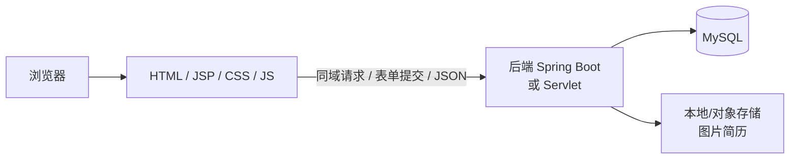

# 网站技术架构文档

> 依据：`网站功能规划`、`网站设计图/`  
> 原则：只覆盖规划内 10 项功能；方案保持简单可落地；**前端不使用任何前端框架**；后端采用 Java 技术栈。

---

## 1. 前后端技术架构总体描述

本站为**企业展示型官网**：页面用 **HTML / JSP + CSS + 原生 JavaScript** 完成展示与表单交互；后端用 Java（Spring Boot）提供接口与数据持久化。前后端可同域部署在同一 Web 应用（`war`）中，由 Servlet/JSP 渲染页面，必要时通过 `/api` 返回 JSON 供页面脚本调用。



### 1.1 分层说明

| 层级 | 职责 |
|------|------|
| 表现层（前端） | JSP/HTML 页面、苹果风格 CSS、原生 JS 交互；表单校验与简单反馈；无 Vue/React 等框架 |
| 接口层（后端 Controller / Servlet） | 接收请求、参数校验；既可转发到 JSP，也可返回统一 JSON |
| 业务层（Service） | 各功能业务逻辑（发布状态过滤、审核、统计汇总等） |
| 持久层（Mapper + MySQL） | 表数据读写 |
| 文件存储 | 产品/新闻图片、简历附件等静态资源 |

### 1.2 导航与页面对应

| 菜单位置 | 功能 | 页面路径（示例） |
|----------|------|------------------|
| 顶栏平铺 | 首页、关于我们、产品中心、新闻中心、联系我们 | `/` 或 `/index.jsp`、`/about.jsp`、`/products.jsp`、`/news.jsp`、`/contact.jsp` |
| 「更多」折叠 | 加入我们、友情链接、网站地图、网站统计、网站留言 | `/join.jsp`、`/links.jsp`、`/sitemap.jsp`、`/stats.jsp`、`/messages.jsp` |

详情页可用查询参数，例如：`/product-detail.jsp?id=1`、`/news-detail.jsp?id=1`。

### 1.3 统一约定（保持简单）

- 接口前缀：`/api`（可选；列表/详情也可由 Servlet 直接塞进 `request` 再 `forward` 到 JSP）
- JSON 响应格式（若用接口）：`{ "code": 0, "message": "ok", "data": {} }`
- 内容类数据（产品、新闻、职位、友链等）带 `status`：草稿 / 已发布；前台只查已发布
- 留言、联系咨询、友链申请、简历投递：写入后默认「待处理/待审核」，由简单管理端或 SQL 处理即可（不单独扩需求）
- **不引入** npm、Vite、Vue、React、Axios、Webpack 等前端工程化与框架

---

## 2. 前后端技术栈

### 2.1 前端（最简原生）

| 类别 | 选型 | 说明 |
|------|------|------|
| 页面 | HTML + JSP | 静态结构用 HTML；需服务端填数据时用 JSP（EL / JSTL） |
| 样式 | 原生 CSS | 按设计图实现苹果风（色值、磨砂顶栏、全宽 Hero）；可拆 `css/site.css`，不引入 UI 框架 |
| 脚本 | 原生 JavaScript | 导航「更多」菜单、滚动顶栏、表单校验、简单 `fetch`/`XMLHttpRequest`；不引入 jQuery / Vue 等 |
| 布局复用 | JSP `include` | 顶栏、页脚抽成 `header.jsp` / `footer.jsp` 公共片段 |
| 图表（仅统计页） | 原生 Canvas 或纯 CSS | 可选极简折线；**不强制** ECharts |

### 2.2 后端（Java）

| 类别 | 选型 | 说明 |
|------|------|------|
| 语言 | JDK 1.8 | 项目约定 Java 版本 |
| 核心框架 | Spring Framework 5.x | Web MVC、IoC、事务等（不用 Spring 6） |
| 应用框架 | Spring Boot 2.7.x | 基于 Spring 5，快速搭建；兼容 JDK 1.8；也可先用纯 Servlet + JSP 落地 |
| ORM | MyBatis-Plus 3.5.x | 简单 CRUD（选用支持 JDK 8 的版本） |
| 校验 | Spring Validation（`javax.validation`）或手工校验 | 表单字段校验 |
| 数据库 | MySQL 8 | 业务数据 |
| 构建 | Maven | 依赖与打包；`maven.compiler.source/target` 均为 `1.8` |
| 文件 | 本地目录或 OSS | 图片、简历；开发期可用本地 |

### 2.3 部署（简要）

- 整体打成 **`war`**（或 Spring Boot 可执行包），由 Tomcat 等容器运行；**页面与接口同域**，无需单独前端构建
- 静态资源：`css/`、`js/`、`images/` 放在 `src/main/webapp` 下直接由容器托管
- 数据库：独立 MySQL 实例

> **版本约束**：后端统一 **JDK 1.8 + Spring 5**（若用 Spring Boot 则 2.7.x）。不要升级到 Spring Boot 3 / Spring 6（需更高 JDK）。  
> **前端约束**：只用 HTML、JSP、CSS、原生 JS，禁止前端框架与打包工具链。

---

## 3. 各功能技术设计 / 实现方案

以下仅覆盖功能规划中的 10 项，不扩展其它业务。

---

### 3.1 网站首页

**目标**：品牌 Hero、亮点区块、最新动态入口。

| 端 | 方案 |
|----|------|
| 前端 | `index.jsp`；顶栏/页脚 `include`；Hero/亮点可用 JSP 输出或写死默认文案；「最新动态」由服务端查最近 3 条新闻，用 JSTL 循环渲染 |
| 后端 | `HomeServlet` / `GET /api/home`：返回亮点配置（可选）+ 最新新闻摘要；或页面 Servlet `forward` 到 `index.jsp` |
| 数据 | 复用新闻表；首页文案可放 `site_config`（键如 `home.hero.title`），无配置时页面写死默认文案 |

**实现要点**：首屏主视觉优先加载；CTA「了解更多」锚点滚动，「立即体验」跳转 `products.jsp`。

---

### 3.2 网站关于我们

**目标**：使命、故事、理念、团队、历程展示。

| 端 | 方案 |
|----|------|
| 前端 | `about.jsp`；按设计图用 HTML 分块，CSS 排版；历程用列表或简单时间线标记 |
| 后端 | `GET /api/about` 或 Servlet 取数后 `forward` 到 JSP |
| 数据 | 表 `about_section` + 可选 `about_timeline` |

**实现要点**：内容偏静态，改动少；无复杂交互。

---

### 3.3 网站产品中心

**目标**：产品线展示、产品列表、产品详情。

| 端 | 方案 |
|----|------|
| 前端 | `products.jsp` 列表；`product-detail.jsp?id=` 详情；品类可用链接 query 或原生 JS 切换显示 |
| 后端 | `GET /api/products`、`GET /api/products/{id}`，或 Servlet 查库后转发 JSP |
| 数据 | 表 `product` |

**实现要点**：前台只展示已发布；详情特性区用服务端循环输出全宽区块即可。

---

### 3.4 网站新闻中心

**目标**：分类列表、头条、文章详情。

| 端 | 方案 |
|----|------|
| 前端 | `news.jsp` 列表 + 分类链接/Tab（原生 JS）；`news-detail.jsp?id=` 详情 |
| 后端 | `GET /api/news`、`GET /api/news/{id}`，或 Servlet + JSP |
| 数据 | 表 `news` |

**实现要点**：详情可读量 `view_count + 1`（供统计页聚合，非必须实时）。

---

### 3.5 网站联系我们

**目标**：展示联系方式 + 提交咨询表单。

| 端 | 方案 |
|----|------|
| 前端 | `contact.jsp`；左侧联系信息，右侧原生 `<form>`；JS 校验邮箱/必填后提交 |
| 后端 | `GET` 展示联系方式；`POST /api/contact` 或表单 `action` 到 Servlet 写入 |
| 数据 | `site_config` + 表 `contact_message` |

**实现要点**：与「网站留言」分表；提交成功用 JSP 提示页或页面内文案反馈。

---

### 3.6 加入我们

**目标**：招聘宣传、职位列表、投递简历。

| 端 | 方案 |
|----|------|
| 前端 | `join.jsp` 职位列表；`join-detail.jsp?id=` 或同页展开；投递用 `multipart/form-data` 原生表单 |
| 后端 | `GET` 职位；`POST` 接收简历上传 |
| 数据 | 表 `job`、`job_application` |

**实现要点**：限制文件类型与大小（如 pdf/doc ≤ 5MB）；库中只存路径。

---

### 3.7 网站友情链接

**目标**：分组展示友链；可申请友链。

| 端 | 方案 |
|----|------|
| 前端 | `links.jsp`；分组列表 + 底部申请表单（原生 HTML） |
| 后端 | 列表仅已发布；`POST` 申请写入待审 |
| 数据 | 表 `friend_link` |

**实现要点**：外链 `target="_blank"` + `rel="noopener noreferrer"`。

---

### 3.8 网站地图

**目标**：面向用户的全站目录页。

| 端 | 方案 |
|----|------|
| 前端 | `sitemap.jsp`；三列目录：主导航五项、「更多」五项、产品/新闻链接 |
| 后端 | 聚合已发布产品/新闻标题列表（限最近 N 条）后交给 JSP |
| 数据 | 无独立业务表 |

**实现要点**：栏目结构写死常量，与导航保持一致。

---

### 3.9 网站统计

**目标**：公开访问概况（今日/本月访问、内容数量、近 30 日趋势、热门页面）。

| 端 | 方案 |
|----|------|
| 前端 | `stats.jsp`；大数字 KPI + **原生 Canvas 简易折线**（或不画图仅表格）；热门页面列表 |
| 后端 | `GET /api/stats/summary` 或 Servlet 汇总后转发 |
| 数据 | 表 `page_view_daily`；内容数量 `COUNT` |

**实现要点（简单）**：

1. 页面加载时 `POST /api/stats/pv`（或过滤器统计）按天累加 PV。  
2. 不做用户画像、不做 IP 明细公开展示。  
3. 无数据时显示「统计筹备中」亦可。  
4. **不引入 ECharts**，保持原生实现。

---

### 3.10 网站留言

**目标**：访客留言板；审核后公开展示。

| 端 | 方案 |
|----|------|
| 前端 | `messages.jsp`；左侧发表表单，右侧已通过留言列表（JSTL 循环） |
| 后端 | `GET` 仅已通过；`POST` 写入待审核 |
| 数据 | 表 `guestbook` |

**实现要点**：邮箱不展示在列表；提交提示「审核后公开」；可用 IP 短时限流。

---

## 4. 核心数据表一览（简化）

| 表名 | 用途 |
|------|------|
| `site_config` | 首页文案、联系方式等键值配置 |
| `about_section` / `about_timeline` | 关于我们 |
| `product` | 产品 |
| `news` | 新闻 |
| `contact_message` | 联系我们提交 |
| `job` / `job_application` | 职位与投递 |
| `friend_link` | 友情链接 |
| `page_view_daily` | 访问统计按日汇总 |
| `guestbook` | 网站留言 |

不单独为「网站地图」建表。

---

## 5. 后端模块划分（简单包结构）

```
com.example.site
├── common          // 统一响应、异常处理
├── config          // 文件上传路径等
├── modules
│   ├── home
│   ├── about
│   ├── product
│   ├── news
│   ├── contact
│   ├── job
│   ├── friendlink
│   ├── sitemap
│   ├── stats
│   └── guestbook
└── SiteApplication
```

每个模块：`Controller`（或 `Servlet`）+ `Service` + `Entity` + `Mapper`，与上表功能一一对应，避免过度分层。

---

## 6. 前端目录划分（简单 · webapp）

```
src/main/webapp/
├── css/
│   └── site.css              // 苹果风全局样式与变量
├── js/
│   └── site.js               // 导航、顶栏滚动、表单校验等
├── images/                   // 静态图片
├── WEB-INF/
│   ├── web.xml
│   └── jsp/                  // 可选：仅内部 forward 的 JSP
│       ├── header.jsp        // 顶栏：平铺五项 + 「更多」
│       └── footer.jsp        // 页脚
├── index.jsp                 // 首页
├── about.jsp
├── products.jsp
├── product-detail.jsp
├── news.jsp
├── news-detail.jsp
├── contact.jsp
├── join.jsp
├── links.jsp
├── sitemap.jsp
├── stats.jsp
└── messages.jsp
```

顶栏：前五项普通 `<a href="...">` 平铺；后五项放入「更多」下拉（原生 JS 控制显隐），与设计图、功能规划一致。公共头尾用 `<%@ include file="..." %>` 或 `<jsp:include>` 复用。

---

## 7. 安全与其它（点到为止）

- 开放 `POST` 接口/表单做基础校验与简单限流，防止刷留言/咨询  
- 上传文件校验类型与大小  
- 管理端若仅内网使用，可用 Spring Security 表单登录保护写接口；**不作为本站对外功能规划的一部分**  
- 同域 JSP + 接口部署时通常**不必**为浏览器跨域单独配 CORS；若以后静态资源分域名再按需放开  

---

*本文档仅描述规划内 10 项功能的技术实现路径，不扩展额外业务。前端统一为 HTML / JSP / CSS / 原生 JS，不使用前端框架。*
