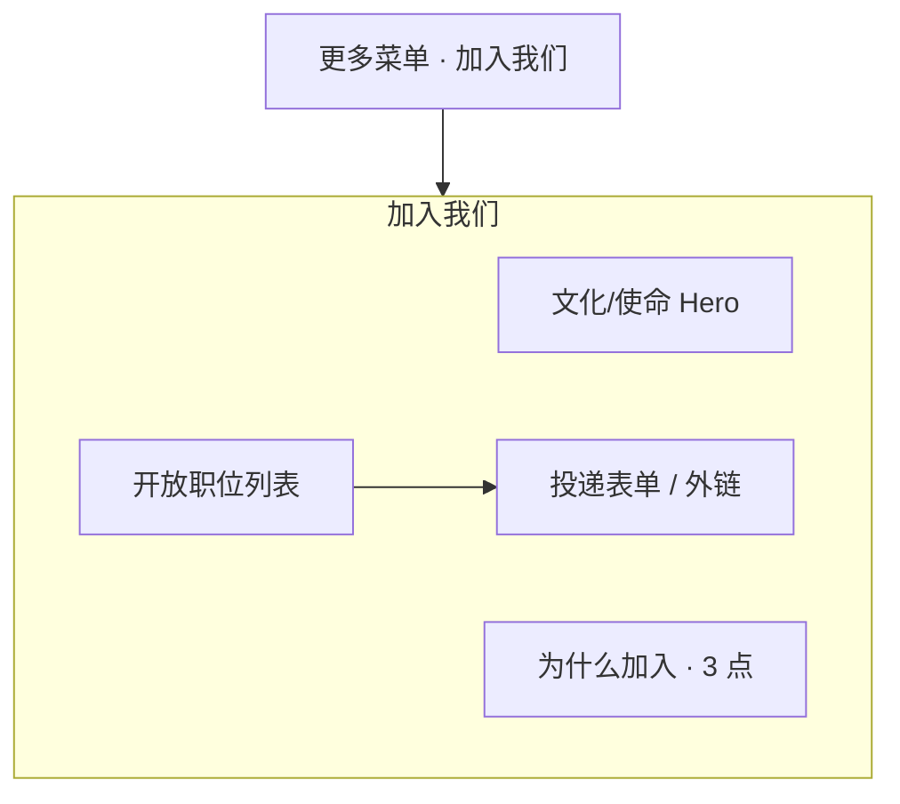

# 网站设计图 · 加入我们

> 风格基准：苹果 Jobs 招聘页 — 使命先行、岗位列表清晰、表单克制。  
> 入口：顶部「更多」折叠菜单（非五项平铺项）。

---

## 1. 页面信息架构



---

## 2. 线框布局（桌面端）

```
┌──────────────────────────────────────────────────────────────────────────┐
│  ● Logo    首页  关于我们  产品中心  新闻中心  联系我们       [更多 ▾]*  │
│                              └ 加入我们（当前）                            │
├──────────────────────────────────────────────────────────────────────────┤
│                                                                          │
│                         加入我们                                          │
│                      和优秀的人，一起做有意义的事                           │
│                                                                          │
│              ████████████ 团队/办公全宽主视觉 ████████████████████████    │
│                                                                          │
├──────────────────────────────────────────────────────────────────────────┤
│  为什么加入我们                                                          │
│  成长空间 · 影响力 · 生活平衡（三列极简文案，无厚重卡片）                   │
├──────────────────────────────────────────────────────────────────────────┤
│  开放职位                                                                │
│  ┌────────────────────────────────────────────────────────────────────┐  │
│  │ 职位名称                          地点 · 类型          [ 查看 ]    │  │
│  ├────────────────────────────────────────────────────────────────────┤  │
│  │ 职位名称                          地点 · 类型          [ 查看 ]    │  │
│  ├────────────────────────────────────────────────────────────────────┤  │
│  │ 职位名称                          地点 · 类型          [ 查看 ]    │  │
│  └────────────────────────────────────────────────────────────────────┘  │
│  （列表为交互容器：整行可点）                                              │
├──────────────────────────────────────────────────────────────────────────┤
│  职位详情抽屉/页：职责 · 要求 · [投递简历]                                 │
│  投递：姓名 / 邮箱 / 电话 / 简历上传 / 简短自荐                            │
├──────────────────────────────────────────────────────────────────────────┤
│  Footer                                                                  │
└──────────────────────────────────────────────────────────────────────────┘
```

---

## 3. 视觉规范

| 维度 | 规范 |
|------|------|
| Hero | 深色或浅色全宽，标题白色或近黑 |
| 职位行 | 底部分割线 `#D2D2D7`，悬停浅灰底 |
| 按钮 | 「查看」「投递」用蓝文字链或小胶囊 |
| 空职位 | 「暂无开放职位，欢迎留言联系」链到联系我们/留言 |

---

## 4. 移动端

- 职位行改为：标题主导，地点次行，「查看」右对齐或整卡点击。
- 投递表单全宽单列。

---

## 5. 交互要点

1. 「更多」展开时高亮「加入我们」。  
2. 简历上传：限制类型与大小，进度条极简。  
3. 成功态：独立确认视图，不弹多重模态。

---

*文档用途：招聘页视觉与流程设计依据。*
