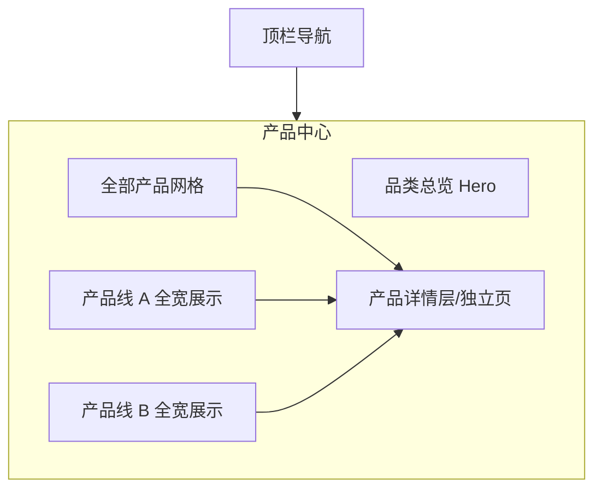

# 网站设计图 · 网站产品中心

> 风格基准：苹果产品矩阵页 — 大图陈列、品类分区、点击进入详情。  
> 导航：产品中心为当前选中项。

---

## 1. 页面信息架构



---

## 2. 线框布局（桌面端）

```
┌──────────────────────────────────────────────────────────────────────────┐
│  ● Logo    首页  关于我们  产品中心*  新闻中心  联系我们       [更多 ▾]   │
├──────────────────────────────────────────────────────────────────────────┤
│                                                                          │
│                         产品中心                                          │
│                      为你精选的下一代体验                                  │
│                                                                          │
│              ████████████ 旗舰产品全宽主视觉 ████████████████████████     │
│                         [ 进一步了解 ]  [ 购买/咨询 ]                      │
│                                                                          │
├──────────────────────────────────────────────────────────────────────────┤
│  产品线 A · 标题 + 一句 · 全宽场景图 · [了解更多]                           │
├──────────────────────────────────────────────────────────────────────────┤
│  产品线 B · 反向深浅背景 · 同结构                                          │
├──────────────────────────────────────────────────────────────────────────┤
│  全部产品                                                                │
│  ┌──────────┐ ┌──────────┐ ┌──────────┐ ┌──────────┐                     │
│  │ 产品图    │ │ 产品图    │ │ 产品图    │ │ 产品图    │                     │
│  │ 名称      │ │ 名称      │ │ 名称      │ │ 名称      │                     │
│  │ 一句卖点  │ │ 一句卖点  │ │ 一句卖点  │ │ 一句卖点  │                     │
│  └──────────┘ └──────────┘ └──────────┘ └──────────┘                     │
│  （网格为浏览交互容器；视觉上轻量，避免厚重卡片阴影）                         │
├──────────────────────────────────────────────────────────────────────────┤
│  Footer                                                                  │
└──────────────────────────────────────────────────────────────────────────┘
```

---

## 3. 产品详情页线框（二级）

```
┌──────────────────────────────────────────────────────────────────────────┐
│  顶栏（同站）                                                             │
├──────────────────────────────────────────────────────────────────────────┤
│  产品名（超大） · 一句定位 · [咨询] [规格]                                  │
│  ████████████████ 产品全宽展示图 / 视频 ████████████████████████████████  │
├──────────────────────────────────────────────────────────────────────────┤
│  特性卷轴：特性1 全宽 → 特性2 全宽 → 特性3 全宽                             │
├──────────────────────────────────────────────────────────────────────────┤
│  技术规格表（干净表格，无多余装饰）                                         │
└──────────────────────────────────────────────────────────────────────────┘
```

---

## 4. 视觉规范

| 维度 | 规范 |
|------|------|
| 产品图 | 白底或场景实拍，边缘 bleed；禁止拼贴拼盘主 Hero |
| 网格 | 2–4 列；间距宽松（≥24px）；背景统一浅灰 |
| 文字 | 产品名 SemiBold；卖点 Secondary `#86868B` |
| CTA | 蓝色文字链「进一步了解」为主，实心按钮慎用 |

---

## 5. 移动端

- 产品线区块纵向堆叠；网格改为 2 列或 1 列。
- 详情页特性区单列全宽。

---

## 6. 交互要点

1. 悬停产品项：轻微上浮或图片缩放（幅度克制）。  
2. 筛选（可选）：顶部轻量品类 Tab，样式贴近苹果品类条。  
3. 空状态：极简插画 +「敬请期待」。

---

*文档用途：产品中心列表与详情视觉设计依据。*
