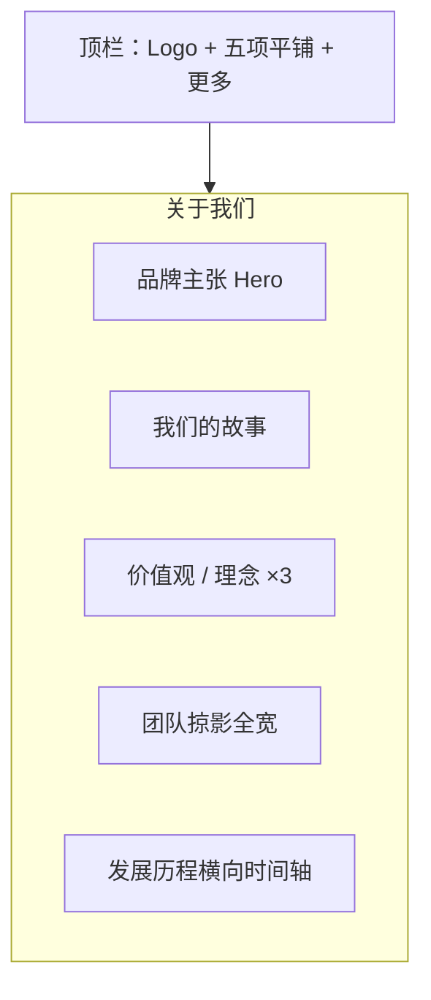

# 网站设计图 · 网站关于我们

> 风格基准：苹果官网 — 叙事型长页、大标题、全宽影像、章节式滚动。  
> 导航：关于我们为当前选中项；后五项位于「更多」折叠菜单。

---

## 1. 页面信息架构



---

## 2. 线框布局（桌面端）

```
┌──────────────────────────────────────────────────────────────────────────┐
│  ● Logo    首页  关于我们*  产品中心  新闻中心  联系我们       [更多 ▾]   │
├──────────────────────────────────────────────────────────────────────────┤
│                                                                          │
│                         关于我们（品牌级标题）                             │
│                      一句使命陈述 · 简洁有力                               │
│                                                                          │
│              ████████████ 全宽品牌/办公/场景主视觉 ████████████████████    │
│                                                                          │
├──────────────────────────────────────────────────────────────────────────┤
│  我们的故事                                                              │
│  左：长文叙述（舒适行宽）    右：辅助影像（非卡片嵌套，可全宽切分）         │
├──────────────────────────────────────────────────────────────────────────┤
│  我们相信                                                                │
│  ┌─────────┐  ┌─────────┐  ┌─────────┐                                   │
│  │ 理念一   │  │ 理念二   │  │ 理念三   │  ← 极简分栏，无重阴影卡片感       │
│  │ 短说明   │  │ 短说明   │  │ 短说明   │                                   │
│  └─────────┘  └─────────┘  └─────────┘                                   │
├──────────────────────────────────────────────────────────────────────────┤
│  团队 · 全宽人像/协作场景 + 一句团队主张                                   │
├──────────────────────────────────────────────────────────────────────────┤
│  历程 · 横向时间轴（年份 + 一句话节点）                                    │
├──────────────────────────────────────────────────────────────────────────┤
│  Footer                                                                  │
└──────────────────────────────────────────────────────────────────────────┘
```

---

## 3. 视觉规范

| 维度 | 规范 |
|------|------|
| 背景 | `#FFFFFF` / `#F5F5F7` 交替 |
| 标题 | 超大字号，字重 Bold，色 `#1D1D1F` |
| 正文 | 17–21px，行高 1.47，最大宽约 680px 保证可读 |
| 强调色 | 仅链接与 CTA 使用 `#0071E3` |
| 动效 | 章节进入视口时淡入；时间轴横向轻微滑动提示 |

---

## 4. 模块说明

### 4.1 Hero
- 品牌名级「关于我们」+ 一句使命 + 全宽主视觉。
- 无浮动徽章、无统计贴片覆盖在主图上。

### 4.2 故事区
- 单一叙事目的；图文左右分栏（移动端改为上下）。

### 4.3 理念区
- 三列等分；去卡片化：无边框阴影，靠留白与字重区分。

### 4.4 历程
- 时间轴为页面唯一交互列表容器；支持键盘左右浏览。

---

## 5. 移动端

- 分栏改为单列；时间轴改为纵向节点列表。
- 顶栏五项收入抽屉，与「更多」五项合并。

---

## 6. 交互要点

1. 锚点导航（可选）：故事 / 理念 / 团队 / 历程。  
2. 「加入我们」入口可在团队区底部以文字链形式出现，指向折叠菜单对应页。

---

*文档用途：关于我们页视觉与信息架构设计依据。*
