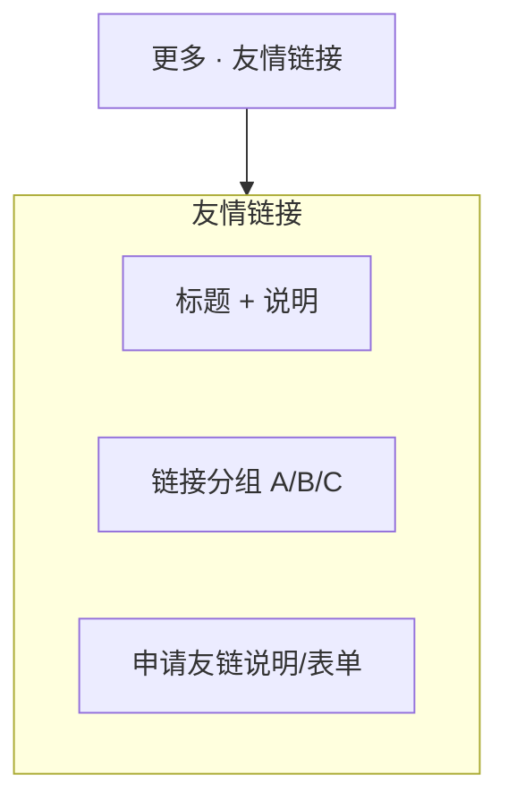

# 网站设计图 · 网站友情链接

> 风格基准：苹果式极简目录页 — 少装饰、高可读、链接层级清晰。  
> 入口：顶部「更多」折叠菜单。

---

## 1. 页面信息架构



---

## 2. 线框布局（桌面端）

```
┌──────────────────────────────────────────────────────────────────────────┐
│  ● Logo    首页  关于我们  产品中心  新闻中心  联系我们       [更多 ▾]   │
├──────────────────────────────────────────────────────────────────────────┤
│  友情链接                                                                │
│  我们与这些伙伴同行                                                       │
├──────────────────────────────────────────────────────────────────────────┤
│  合作伙伴                                                                │
│  · 站点名称 — 一句话简介                          ↗                      │
│  · 站点名称 — 一句话简介                          ↗                      │
│  · 站点名称 — 一句话简介                          ↗                      │
├──────────────────────────────────────────────────────────────────────────┤
│  行业资源                                                                │
│  · 站点名称 — 一句话简介                          ↗                      │
│  · 站点名称 — 一句话简介                          ↗                      │
├──────────────────────────────────────────────────────────────────────────┤
│  申请友情链接                                                            │
│  简短规则说明（开放新窗口、非广告联盟等）                                   │
│  站点名称 / URL / 简介 / 联系邮箱 → [ 提交申请 ]                           │
├──────────────────────────────────────────────────────────────────────────┤
│  Footer                                                                  │
└──────────────────────────────────────────────────────────────────────────┘
```

---

## 3. 视觉规范

| 维度 | 规范 |
|------|------|
| 链接样式 | 默认 `#1D1D1F`，悬停 `#0071E3` + 下划线 |
| 分组标题 | 稍大 SemiBold；组间大留白 |
| 外链图标 | 细线外链箭头，不抢视线 |
| 布局 | 优先列表而非 Logo 墙；若需 Logo，单行轻量，勿拼贴 Hero |

---

## 4. 移动端

- 分组与链接单列；申请表单全宽。

---

## 5. 交互要点

1. 所有友链 `target="_blank"` + `rel="noopener noreferrer"`。  
2. 申请提交成功反馈与联系表单一致的成功态语言。  
3. 后台可审核后展示（实现阶段预留状态：待审/已发布）。

---

*文档用途：友情链接页信息架构与视觉设计依据。*
