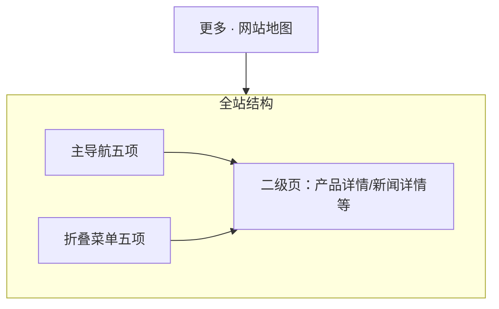
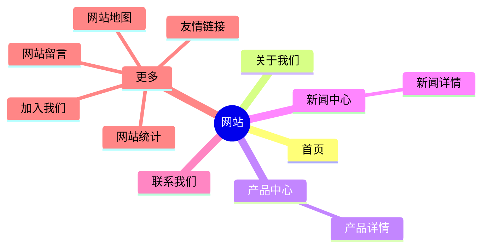

# 网站设计图 · 网站地图

> 对应规划项「网站网站地图」。  
> 风格基准：苹果 Sitemap / 页脚扩展 — 树状清晰、全站可达。  
> 入口：顶部「更多」折叠菜单。

---

## 1. 页面信息架构



---

## 2. 线框布局（桌面端）

```
┌──────────────────────────────────────────────────────────────────────────┐
│  ● Logo    首页  关于我们  产品中心  新闻中心  联系我们       [更多 ▾]   │
├──────────────────────────────────────────────────────────────────────────┤
│  网站地图                                                                │
│  快速找到你需要的页面                                                     │
├──────────────────────────────────────────────────────────────────────────┤
│                                                                          │
│  主要栏目              更多                   内容                       │
│  · 首页                · 加入我们             · 产品详情（索引）         │
│  · 关于我们            · 友情链接             · 新闻文章（索引）         │
│  · 产品中心            · 网站地图             · …                       │
│  · 新闻中心            · 网站统计                                       │
│  · 联系我们            · 网站留言                                       │
│                                                                          │
│  （三列目录；链接文字为主，无卡片栅格堆叠）                                 │
├──────────────────────────────────────────────────────────────────────────┤
│  Footer                                                                  │
└──────────────────────────────────────────────────────────────────────────┘
```

---

## 3. 结构树设计图



---

## 4. 视觉规范

| 维度 | 规范 |
|------|------|
| 列标题 | SemiBold，与页脚 sitemap 风格统一 |
| 链接 | 常规字重，行距宽松 |
| 当前页 | 「网站地图」项可显示为不可点或选中态 |
| 背景 | 纯白或浅灰，极简 |

---

## 5. 移动端

- 三列改手风琴或单列分组标题 + 链接列表。

---

## 6. 交互与 SEO

1. 与 XML Sitemap 分离：本页面向用户，XML 面向爬虫。  
2. 二级内容索引可自动生成（最新 N 条产品/新闻）。  
3. 页脚可放置「网站地图」文字链，与更多菜单双入口。

---

*文档用途：全站地图页布局与导航结构依据。*
