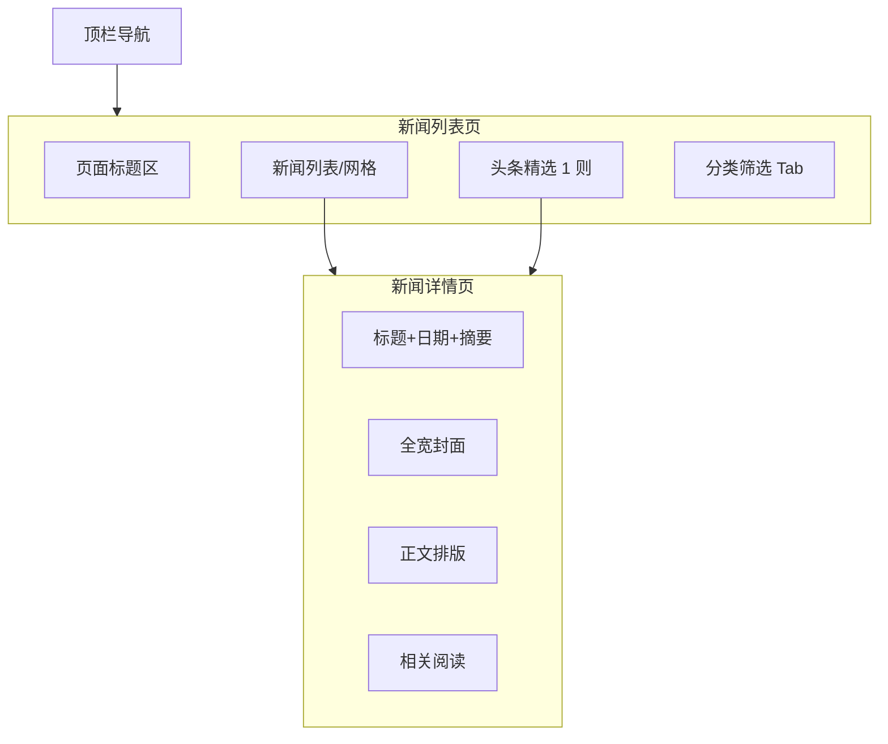

# 网站设计图 · 网站新闻中心

> 风格基准：苹果 Newsroom / 博客列表 — 清晰层级、大标题、日期次要、图文节奏克制。  
> 导航：新闻中心为当前选中项。

---

## 1. 页面信息架构



---

## 2. 线框布局 · 列表页（桌面端）

```
┌──────────────────────────────────────────────────────────────────────────┐
│  ● Logo    首页  关于我们  产品中心  新闻中心*  联系我们       [更多 ▾]   │
├──────────────────────────────────────────────────────────────────────────┤
│  新闻中心                                                                │
│  了解最新动态与观点                                                       │
├──────────────────────────────────────────────────────────────────────────┤
│  [全部] [公司动态] [产品发布] [行业洞察]   ← 轻量 Tab，非胶囊堆叠           │
├──────────────────────────────────────────────────────────────────────────┤
│  ┌────────────────────────────────────────────────────────────────────┐  │
│  │  头条封面全宽                                                         │  │
│  │  标题（大） · 日期 · 一句摘要 · [阅读全文]                             │  │
│  └────────────────────────────────────────────────────────────────────┘  │
├──────────────────────────────────────────────────────────────────────────┤
│  ┌────────────┐  ┌────────────┐  ┌────────────┐                          │
│  │ 缩略图      │  │ 缩略图      │  │ 缩略图      │                          │
│  │ 标题        │  │ 标题        │  │ 标题        │                          │
│  │ 日期 · 分类 │  │ 日期 · 分类 │  │ 日期 · 分类 │                          │
│  └────────────┘  └────────────┘  └────────────┘                          │
│  … 加载更多 / 分页（极简数字或「显示更多」文字链）                          │
├──────────────────────────────────────────────────────────────────────────┤
│  Footer                                                                  │
└──────────────────────────────────────────────────────────────────────────┘
```

---

## 3. 线框布局 · 详情页

```
┌──────────────────────────────────────────────────────────────────────────┐
│  顶栏                                                                    │
├──────────────────────────────────────────────────────────────────────────┤
│           （居中内容栏 max-width ≈ 720px）                                 │
│  分类标签（文字色次级）                                                   │
│  文章标题（超大，可多行）                                                 │
│  发布日期 · 作者                                                          │
│                                                                          │
│  ████████████████ 可选全宽封面（突破内容栏至边缘）██████████████████████  │
│                                                                          │
│  正文：衬线或无衬线长文排版，图注次级色                                    │
│  …                                                                       │
│  分享（极简图标） · 返回列表                                              │
│  相关阅读 · 两列链接列表                                                  │
└──────────────────────────────────────────────────────────────────────────┘
```

---

## 4. 视觉规范

| 维度 | 规范 |
|------|------|
| 列表背景 | `#F5F5F7`；条目区白底或统一浅底 |
| 日期 | `#86868B`，小字号 |
| 标题悬停 | 变为链接蓝或下划线，无夸张动效 |
| 正文 | 行宽舒适；图片全宽于内容栏内，圆角可选 0–8px |

---

## 5. 移动端

- 头条与列表均单列；Tab 可横向滚动。
- 详情页边距 16–20px；封面全宽。

---

## 6. 交互要点

1. Tab 切换使用 `startTransition` 友好的列表更新（实现阶段）。  
2. 分页优先「显示更多」无限滚动，兼顾客厅式浏览。  
3. SEO：详情页独立 URL、语义化标题层级。

---

*文档用途：新闻列表与详情视觉设计依据。*
