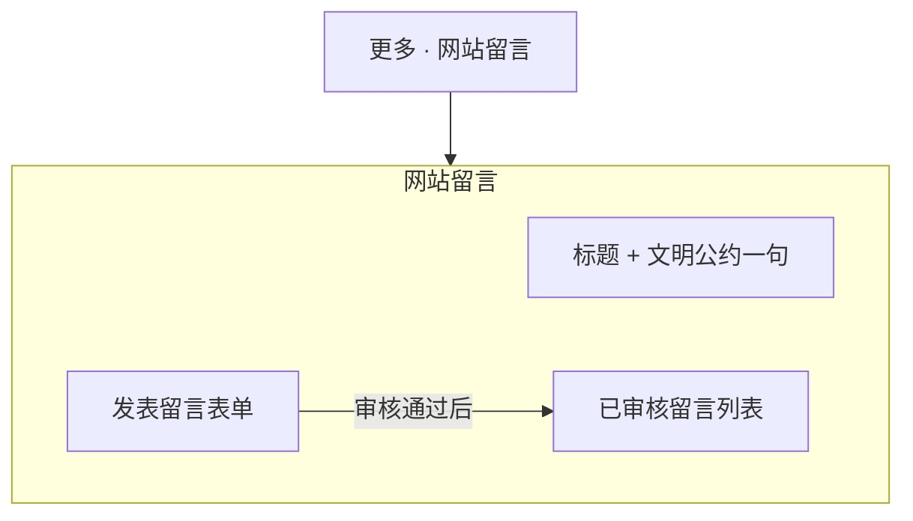

# 网站设计图 · 网站留言

> 对应规划项「网站网站留言」。  
> 风格基准：苹果反馈/社区留言 — 表单简洁、留言流可读、审核友好。  
> 入口：顶部「更多」折叠菜单。  
> 与「联系我们」区分：本页偏公开留言板/访客寄语；联系我们偏商务联络。

---

## 1. 页面信息架构



---

## 2. 线框布局（桌面端）

```
┌──────────────────────────────────────────────────────────────────────────┐
│  ● Logo    首页  关于我们  产品中心  新闻中心  联系我们       [更多 ▾]   │
├──────────────────────────────────────────────────────────────────────────┤
│  网站留言                                                                │
│  写下你的想法。请保持友善与尊重。                                          │
├───────────────────────────────┬──────────────────────────────────────────┤
│  发表留言                      │  最近留言                                 │
│                               │                                          │
│  昵称 *                       │  ┌────────────────────────────────────┐  │
│  邮箱（可选，不公开）          │  │ 昵称 · 时间                         │  │
│  留言内容 *                   │  │ 留言正文……                          │  │
│                               │  └────────────────────────────────────┘  │
│  [ 提交留言 ]                 │  ┌────────────────────────────────────┐  │
│                               │  │ 昵称 · 时间                         │  │
│  提交后提示：需审核后展示      │  │ 留言正文……                          │  │
│                               │  └────────────────────────────────────┘  │
│                               │  … 加载更多                              │
├───────────────────────────────┴──────────────────────────────────────────┤
│  Footer                                                                  │
└──────────────────────────────────────────────────────────────────────────┘
```

---

## 3. 留言条目视觉

```
昵称                          2026-07-17
留言正文，最多展示若干行，过长可展开。
─────────────────────────────────────  ← 极细分隔线
```

- 无头像墙亦可；若加头像用字母色块，避免卡通贴纸感。
- 管理员回复：缩进次级块，标签「回复」次级色。

---

## 4. 视觉规范

| 维度 | 规范 |
|------|------|
| 表单 | 与联系我们同一输入组件语言 |
| 列表背景 | `#F5F5F7` 页面底，条目白底或纯分割线 |
| 时间 | `#86868B` |
| 空列表 | 「还没有留言，来写第一条吧」 |

---

## 5. 移动端

- 表单在上、列表在下单列堆叠。
- 提交按钮吸底可选（非必须）。

---

## 6. 交互与安全

1. 提交成功：表单重置 + Toast/内联「已提交，审核后公开」。  
2. 频率限制与敏感词过滤（实现阶段）。  
3. 仅展示已审核内容；邮箱永不公开展示。  
4. 商务需求引导链至「联系我们」。

---

*文档用途：留言板页布局与交互设计依据。*
