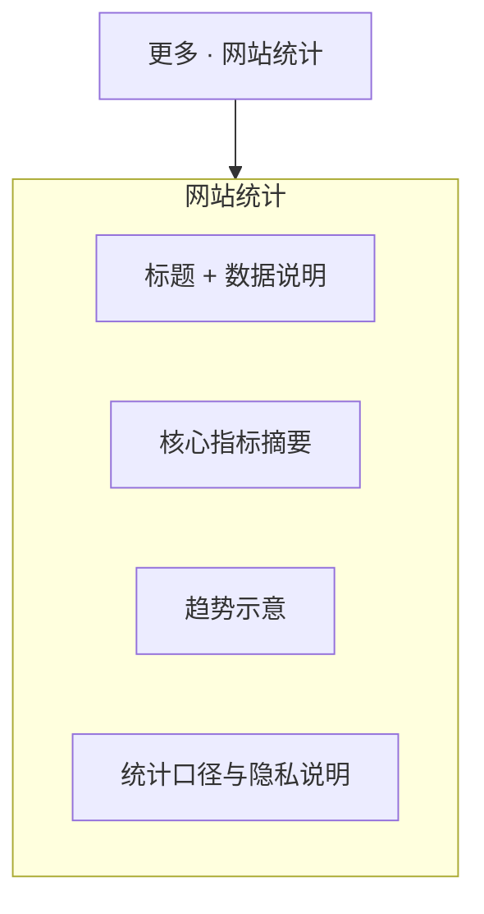

# 网站设计图 · 网站统计

> 对应规划项「网站网站统计」。  
> 风格基准：苹果隐私/数据说明页 — 克制图表、说明优先于炫技大屏。  
> 入口：顶部「更多」折叠菜单。  
> 说明：面向访客的公开统计摘要页，非内部运营后台。

---

## 1. 页面信息架构



---

## 2. 线框布局（桌面端）

```
┌──────────────────────────────────────────────────────────────────────────┐
│  ● Logo    首页  关于我们  产品中心  新闻中心  联系我们       [更多 ▾]   │
├──────────────────────────────────────────────────────────────────────────┤
│  网站统计                                                                │
│  以透明的方式，了解站点的基本访问概况                                       │
├──────────────────────────────────────────────────────────────────────────┤
│                                                                          │
│     今日访问          本月访问          累计内容                            │
│      1,234             45,678           产品 12 · 新闻 86                  │
│                                                                          │
│  （数字超大字重；标签次级色；禁止彩虹渐变仪表盘风格）                        │
├──────────────────────────────────────────────────────────────────────────┤
│  近 30 日访问趋势                                                        │
│  ┌────────────────────────────────────────────────────────────────────┐  │
│  │         ╱╲    ╱╲                                                   │  │
│  │    ╱╲  ╱  ╲  ╱  ╲___╱                                              │  │
│  │___╱  ╲╱    ╲╱                                                      │  │
│  │  单色折线/面积图 · 坐标轴极简 · 无多余图例堆叠                         │  │
│  └────────────────────────────────────────────────────────────────────┘  │
├──────────────────────────────────────────────────────────────────────────┤
│  热门页面（可选）                                                         │
│  1. 首页 ········ 32%                                                   │
│  2. 产品中心 ····· 21%                                                   │
│  3. 新闻中心 ····· 15%                                                   │
├──────────────────────────────────────────────────────────────────────────┤
│  说明：数据每日更新；不含可识别个人身份信息。详见隐私政策。                  │
├──────────────────────────────────────────────────────────────────────────┤
│  Footer                                                                  │
└──────────────────────────────────────────────────────────────────────────┘
```

---

## 3. 视觉规范

| 维度 | 规范 |
|------|------|
| 数字 | SF 类等宽感大号数字，`#1D1D1F` |
| 图表 | 单色（黑/灰或单一蓝），网格线极淡 |
| 布局 | 指标横排；图表全宽内容栏；非运营后台侧边栏布局 |
| 禁忌 | 避免多色渐变、发光、圆角仪表盘卡片堆叠 |

---

## 4. 移动端

- KPI 改为 2×2 或纵向堆叠；图表横向可滑动查看。

---

## 5. 交互与数据

1. 公开页仅展示汇总指标；敏感来源/IP 不上屏。  
2. 加载态用浅骨架屏，与苹果式 loading 一致。  
3. 若未接入统计服务，显示「统计筹备中」占位，保持版面稳定。

---

*文档用途：公开统计页视觉与信息设计依据。*
