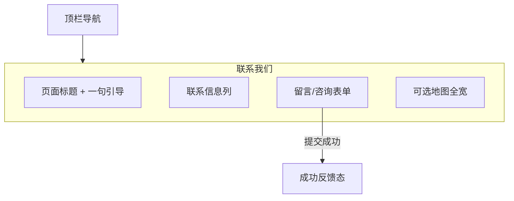

# 网站设计图 · 网站联系我们

> 风格基准：苹果 Support / Contact — 冷静表单、清晰联系方式、大留白。  
> 导航：联系我们为当前选中项。

---

## 1. 页面信息架构



---

## 2. 线框布局（桌面端）

```
┌──────────────────────────────────────────────────────────────────────────┐
│  ● Logo    首页  关于我们  产品中心  新闻中心  联系我们*      [更多 ▾]   │
├──────────────────────────────────────────────────────────────────────────┤
│                                                                          │
│                         联系我们                                          │
│                      我们很乐意听取你的想法                                │
│                                                                          │
├───────────────────────────────┬──────────────────────────────────────────┤
│  联系方式                      │  发送消息                                 │
│                               │                                          │
│  电话  +86 ···                │  姓名 *                                   │
│  邮箱  hello@···              │  邮箱 *                                   │
│  地址  ·······                │  主题                                     │
│  工作时间 工作日 9:00–18:00    │  留言内容 *（多行）                        │
│                               │                                          │
│  [ 在地图中查看 ]              │           [ 提交 ]                        │
│                               │                                          │
├───────────────────────────────┴──────────────────────────────────────────┤
│  ████████████████████ 可选：全宽地图 / 办公环境意象 █████████████████████  │
├──────────────────────────────────────────────────────────────────────────┤
│  Footer                                                                  │
└──────────────────────────────────────────────────────────────────────────┘
```

---

## 3. 表单视觉规范

| 元素 | 规范 |
|------|------|
| 输入框 | 浅底 `#F5F5F7`，圆角 8–12px，聚焦描边 `#0071E3` |
| 标签 | 小字 SemiBold，置于输入框上方 |
| 主按钮 | 蓝色胶囊「提交」，禁用态降低透明度 |
| 错误提示 | 输入框下方红色小字，不打断整页 |
| 成功态 | 替换表单为对勾图标 +「已收到，我们会尽快回复」 |

---

## 4. 与「网站留言」关系

- **联系我们**：对外商务/客服咨询，含电话邮箱地址。  
- **网站留言**（折叠菜单）：偏社区/反馈留言板，可复用表单组件但信息架构不同。  
- 本页提交可与留言后端共用接口，前端文案与字段保持差异。

---

## 5. 移动端

```
┌─────────────────────┐
│ 标题 + 引导          │
│ 联系方式块           │
│ 表单块（全宽）       │
│ 地图（全宽）         │
└─────────────────────┘
```

---

## 6. 交互要点

1. 前端校验：必填、邮箱格式；提交中按钮 loading。  
2. 电话/邮箱一键 `tel:` / `mailto:`。  
3. 地图区不放置浮动信息贴纸，地址以旁侧文字为准。

---

*文档用途：联系我们页布局与表单视觉设计依据。*
