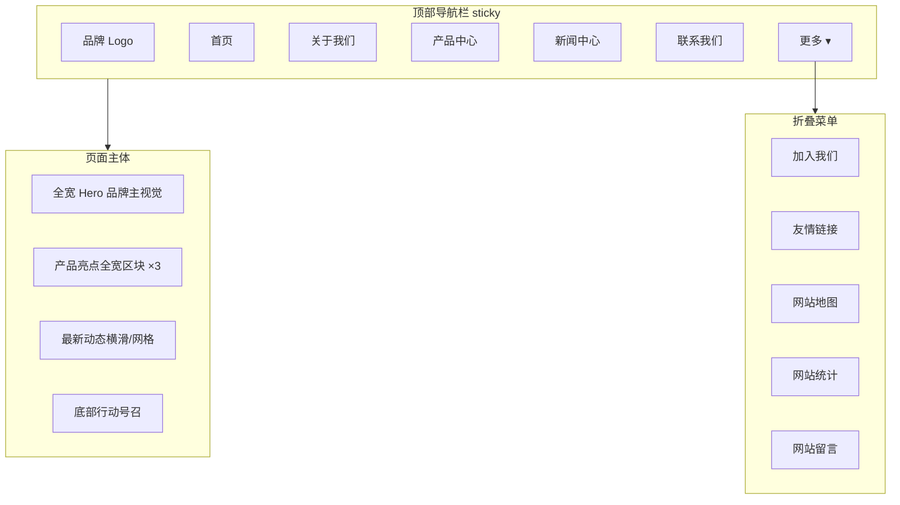

# 网站设计图 · 网站首页

> 风格基准：苹果官网（Apple.com）— 大留白、全宽沉浸式 Hero、极简导航、系统级无衬线字体、克制动效。  
> 导航规则：首页 / 关于我们 / 产品中心 / 新闻中心 / 联系我们 平铺；其余五项收入「更多」菜单。

---

## 1. 页面信息架构



---

## 2. 线框布局（桌面端 ≥1024px）

```
┌──────────────────────────────────────────────────────────────────────────┐
│  ● Logo    首页  关于我们  产品中心  新闻中心  联系我们        [更多 ▾]   │  ← 磨砂半透明顶栏
├──────────────────────────────────────────────────────────────────────────┤
│                                                                          │
│                         品牌名（Hero 级主视觉）                            │
│                      一句支撑文案 · 简短有力                               │
│                         [ 了解更多 ]  [ 立即体验 ]                          │
│                                                                          │
│              ████████████ 全宽产品/场景主视觉（edge-to-edge）████████████   │
│                                                                          │
├──────────────────────────────────────────────────────────────────────────┤
│  区块一：产品亮点 A（深色/浅色交替全宽）                                    │
│  标题 + 一句说明 + 全宽意象                                                │
├──────────────────────────────────────────────────────────────────────────┤
│  区块二：产品亮点 B                                                        │
├──────────────────────────────────────────────────────────────────────────┤
│  区块三：产品亮点 C                                                        │
├──────────────────────────────────────────────────────────────────────────┤
│  最新动态 · 三列卡片（仅作内容列表交互容器）                                 │
├──────────────────────────────────────────────────────────────────────────┤
│  Footer：版权 · 隐私 · 折叠菜单入口复述                                     │
└──────────────────────────────────────────────────────────────────────────┘
```

---

## 3. 视觉规范（苹果风）

| 维度 | 规范 |
|------|------|
| 背景 | 浅灰 `#F5F5F7` 与纯白 `#FFFFFF` 区块交替；Hero 可用深色 `#000000` |
| 主文字 | `#1D1D1F`；次级文字 `#86868B` |
| 字体 | SF Pro / 系统无衬线；标题超大字重 SemiBold–Bold |
| 按钮 | 胶囊形主按钮（蓝 `#0071E3`）+ 文字链次按钮 |
| 动效 | Hero 淡入上移；滚动时区块轻微视差；导航磨砂随滚动加深 |
| 图片 | 全宽 bleed，禁止圆角卡片式嵌套主图 |

---

## 4. 模块说明

### 4.1 顶部导航
- 固定顶部，`backdrop-filter: blur` 磨砂效果。
- 当前页「首页」为选中态（略深字重或下划线）。
- 「更多」点击展开：加入我们、友情链接、网站地图、网站统计、网站留言。

### 4.2 Hero
- 首屏仅含：品牌名、一句 headline、一句支撑句、一组 CTA、一张全宽主视觉。
- 不放统计条、日程、地址块等次要信息。

### 4.3 亮点区块
- 每个区块单一目的：一个标题 + 一句说明 + 一张全宽意象。
- 深浅背景交替，营造节奏。

### 4.4 最新动态
- 从新闻中心取最近 3 条；点击跳转新闻详情/列表。

---

## 5. 移动端适配（≤767px）

```
┌─────────────────────┐
│ Logo          ☰ 更多 │
├─────────────────────┤
│ 品牌名               │
│ 支撑文案             │
│ [主 CTA]             │
│ 全宽主视觉           │
├─────────────────────┤
│ 亮点区块纵向堆叠     │
├─────────────────────┤
│ 动态纵向列表         │
└─────────────────────┘
```

- 五项平铺菜单收入汉堡/「更多」抽屉，与后五项合并展示，保持信息完整。

---

## 6. 交互要点

1. 滚动超过 40px：顶栏背景不透明度提升。  
2. CTA「了解更多」锚点滚动至亮点一；「立即体验」跳转产品中心。  
3. 图片懒加载；首屏主视觉优先 LCP。

---

*文档用途：首页视觉与信息架构设计依据。*
